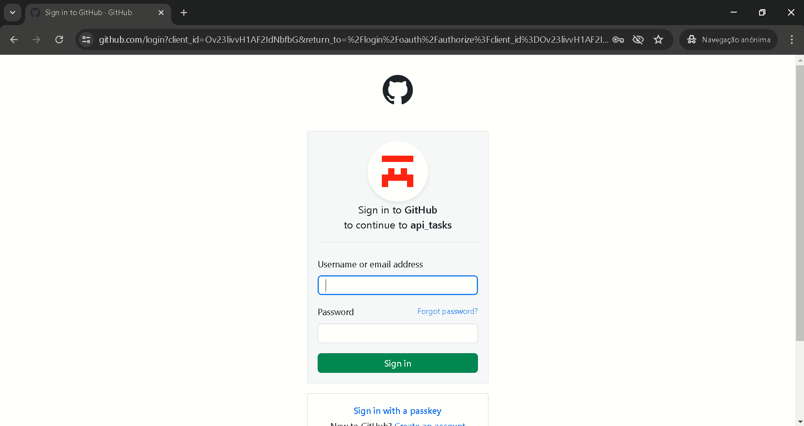
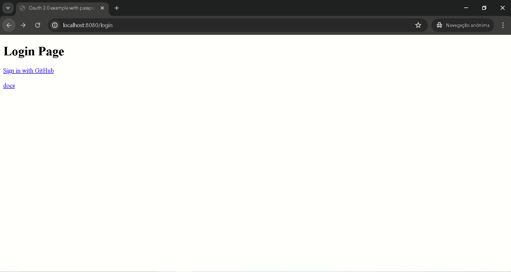
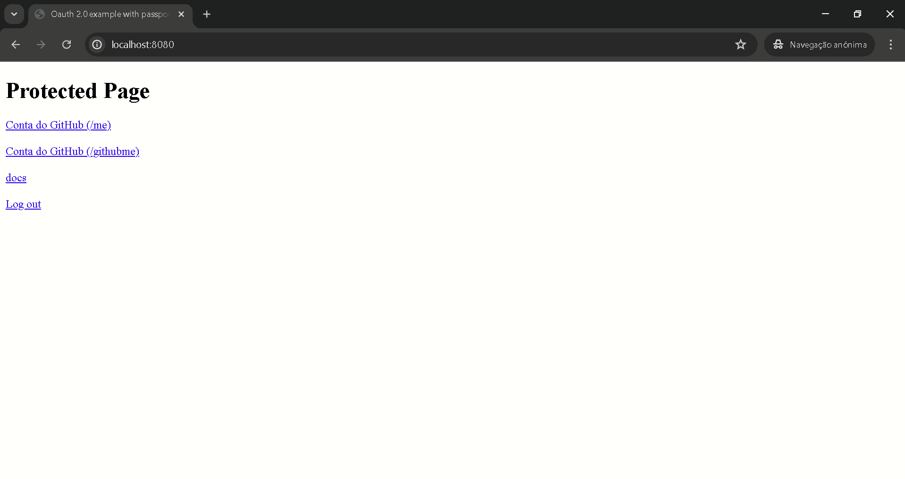
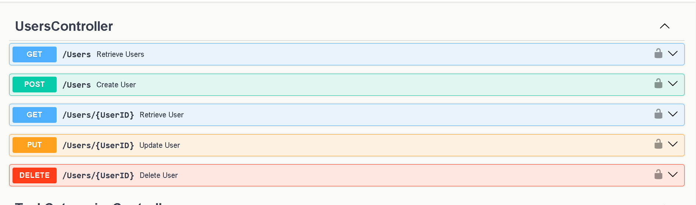
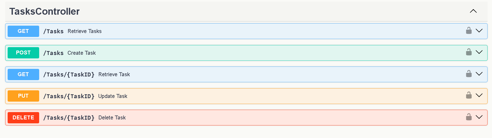
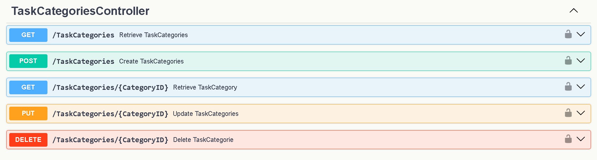
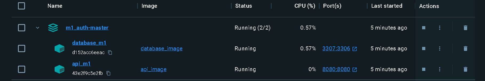

# TaskMaster

Repository to host the project developed for Desenvolvimento Web II, a 2024 subject at UMAIA. Developed by Group 4 : [@pedropires64](https://github.com/pedropires64), [@TiagoBaganha](https://github.com/TiagoBaganha) and [@Duarte35](https://github.com/Duarte35).

## Short theme description

This project is an implementation of a task management system utilizing OAuth 2.0 for authentication via GitHub. It is developed to showcase a structured approach to handling various aspects of task management through a set of well-defined RESTful APIs. The project includes Dockerized containers for easy deployment and integration.

## Repository organization

* Report chapters are in [doc folder](docs).
* Screenshots are in the [prints folder](prints).

## Gallery

| Page      | Image |
| ----------- | ----------- |
| Sign in Page      |        |
| Login Page  |        |
| Home Page |        |
| Users Controllers      |        |
| Task Controllers   |        |
| TaskStatus Controllers | ](prints/taskstatuscontroller.png)       |
| TaskCategories Controllers      |        |
| Docker Containers   |        |

## Technologies

* [HTML5](https://html.spec.whatwg.org/multipage/) + [CSS3](https://www.w3.org/Style/CSS/)
* [Javascript](https://developer.mozilla.org/en-US/docs/Learn/JavaScript)
* [PHP](https://www.php.net/)
* [nodeJS](https://nodejs.org/en/)

### Frameworks and Libraries

* Docker: Used for containerizing the application and its dependencies.
* NodeJS: Backend runtime for building the API.
* Express.js: Framework used for building the RESTful API.
* Passport.js: Middleware for authentication, specifically with GitHub OAuth 2.0 in this project.
* Swagger: For API documentation and testing.
* JQuery: For handling JavaScript operations on the frontend.
* Bootstrap: For styling and responsive design.
* GitHub OAuth 2.0: For user authentication.

### Project presentation
* Chapter 1 :[Project presentation](docs/projectpresentation.md)
### Resources
* Chapter 2 :[Resources](docs/Resources.md)
### Product
* Chapter 3 :[Product](docs/Product.md)

## Grupo _04_
* Pedro Pires | a038057
* Tiago Baganha | a041423
* Vitor Duarte | a042396
